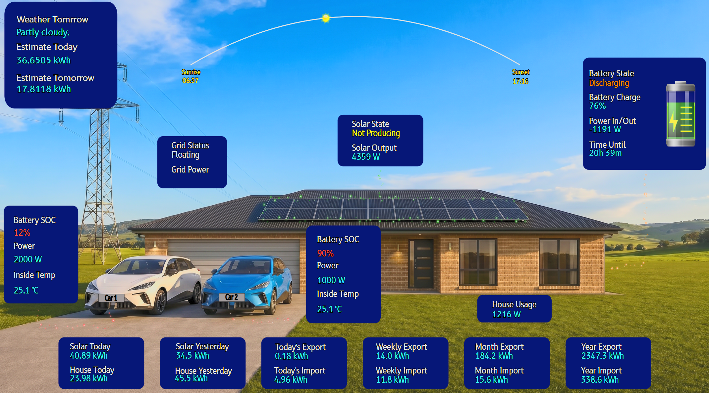

# Advanced Energy Card

 

> **Repository:** [https://github.com/ratava/advanced-energy-card](https://github.com/ratava/advanced-energy-card)  
> **Wiki & full documentation:** [https://ratava.github.io/advanced-energy-card/](https://ratava.github.io/advanced-energy-card/)


Support Brent — ratava  


---

## What's New in 2.0

Version 2.0 is a **major functional code rewrite** — not just an incremental update. The core rendering engine, configuration architecture, and animation system have all been rebuilt from the ground up. The headline addition is the **Overview Profile** — a clean, high-level energy summary designed to live on your main dashboard. Alongside that, the profile and configuration system has been completely redesigned, a new Electron flow animation style has been added, and existing custom SVG backgrounds are automatically migrated on load.

---

## Overview Profile

The Overview layout shows your home energy picture at a glance: solar, battery, grid, house load, and up to two EVs — combined and colour-coded, without the technical detail of the Tech layout.

| Day | Night |
|-----|-------|
|  |  |

- Separate day and night SVG backgrounds with automatic switching via `sun.sun`
- Combined Solar, Battery, Grid and House totals — no per-inverter breakdown needed
- Optional Sun/Moon arc that tracks the day/night cycle across the card
- EV support for zero, one, or two electric vehicles — each with a configurable name plate, SOC colour-coded by charging state, and an animated charge cable flow
- Statistics-enabled **footer cards** — assign any HA entity or statistic to up to six footer slots for daily totals, import/export figures, or any other value you want permanently on screen

---

## Tech Profile


---

## Custom Profiles

Each background SVG carries its own independent set of sensor and styling settings, stored under `_profiles` in your config YAML. Switching between Tech, Overview, or any custom background preserves every profile's settings independently. General settings — language, animation style, update interval, sun/moon display, and so on — are shared across all profiles.

---

## Electron Flow Animation

A new **Electrons** style joins Dashes, Dashes Glow, Fluid Flow, Dots, and Arrows. Electrons renders individual glowing sphere particles that travel the flow paths at power-proportional speed. Particle size, spacing, spread, and pulse rate are all configurable from the editor.

---

## Automatic SVG Migration

When the card detects an older custom SVG background it automatically updates the attribute patterns in memory so the card renders correctly — no manual editing required. A **Download Migrated SVG** button appears in the editor once migration has run.

> **Before replacing your SVG file, always make a backup of the original.**  
> The migration covers the standard attribute patterns used in Advanced Energy Card SVGs but cannot guarantee complete coverage of every heavily customised file. Review the downloaded SVG before deploying it to your HA server.

---

## Breaking Changes

### Profile Architecture (v2.0)

All profile-scoped settings (sensors, colours, font sizes, popup config) are now stored inside `_profiles[snapshotKey]` in the YAML. General settings remain at the top level. **This migration is automatic** — existing configs are restructured on first load with no visible change to the card.

#### If you customised `tech.svg` and kept the filename

The bundled `tech.svg` now includes `data-profile-id="tech"` on its root `<svg>` element. If you edited `tech.svg` and saved it under the same name, add this attribute to your copy after updating:

```xml
<svg ... data-profile-id="tech" ...>
```

Without it the editor shows a one-time "based on" picker when you open the card. After you select the layout type the card remembers your choice automatically.

#### Custom SVG backgrounds not named `tech.svg` or `overview.svg`

The editor shows a one-time "Choose layout type" prompt on first open. Select the layout the SVG is based on. The card records your choice and will not prompt again.

---

## Installation

### HACS (Recommended)

[](https://my.home-assistant.io/redirect/hacs_repository/?owner=Ratava&repository=advanced-energy-card&category=frontend)

Click the badge → Home Assistant opens → the repo is added to HACS. Then go to **HACS → Frontend**, search **Advanced Energy Card**, and install. Finally: **Dashboard → Edit → Add card → Advanced Energy Card**.

**Manual HACS:**
1. Open HACS → **Frontend** → three-dot menu → **Custom repositories**
2. Enter `https://github.com/ratava/advanced-energy-card`, pick **Dashboard**, click **Add**
3. Find **Advanced Energy Card** and click **Install**
4. Restart Home Assistant if prompted

### Manual Installation

1. Download all files from `dist/` from the [latest release](https://github.com/ratava/advanced-energy-card/releases)
2. Copy to `/config/www/community/advanced-energy-card/`
3. Add the Lovelace resource:

```yaml
lovelace:
  resources:
    - url: /local/community/advanced-energy-card/advanced-energy-card.js
      type: module
```

4. Restart Home Assistant

---

## Getting Started

1. Edit your dashboard and click **Add Card**
2. Search for **Advanced Energy Card**
3. The **Initial Configuration** section opens automatically — choose your layout (Tech or Overview) and answer the questions to configure your core sensors
4. Fine-tune colours, animation, popups, and footer cards in the sections that follow

For the complete sensor reference, data-role attribute guide, and SVG customisation instructions see [data-roles.md](data-roles.md) and the [project wiki](https://ratava.github.io/advanced-energy-card/).

---

## Key Features

- **Two profiles out of the box:** Tech (detailed per-element flows) and Overview (clean combined summary)
- Up to six PV string sensors across two arrays, totalized automatically
- Up to four battery systems with SOC, power, and liquid-fill visualisation
- Grid import/export with daily totals and configurable flow thresholds
- Heat pump, pool, hot water, washing machine, dryer, dishwasher, refrigerator, and freezer consumption
- Windmill generation (Tech profile)
- Zero, one, or two EVs with SOC, charging state colour, and animated charge cable flow
- Five animation styles including the new Electrons style
- Day/Night automatic switching with separate backgrounds and animation styles
- Sun/Moon arc tracking the day/night cycle
- Popups for Solar, Battery, Grid, House, and Inverter — each with up to six configurable entity slots
- Statistics-enabled footer cards
- Guided Initial Configuration wizard
- Editor in six languages: English, Italian, German, French, Dutch, Spanish
- Kiosk mode compatible

---

## Core Sensor Options

| Sensor | Notes |
|--------|-------|
| `sensor_pv_total` | Aggregate PV production. Or configure `sensor_pv1`–`sensor_pv6` and the card sums them. |
| `sensor_daily` | Daily PV production total |
| `sensor_home_load` | House consumption |
| `sensor_grid_power` | Net grid power (positive = import). Or use `sensor_grid_import` + `sensor_grid_export`. |
| `sensor_bat1_soc` | Battery 1 state of charge % |
| `sensor_bat1_power` | Battery 1 net power. Or use `sensor_bat1_charge_power` + `sensor_bat1_discharge_power`. |
| `sensor_car_power` | EV 1 charge power |
| `sensor_car_soc` | EV 1 SOC % |
| `sensor_car2_power` | EV 2 charge power |
| `sensor_car2_soc` | EV 2 SOC % |

Up to four batteries (`bat1`–`bat4`), six PV strings per array, two arrays, two grid connections, and two EVs are supported. For the complete list see the [wiki](https://ratava.github.io/advanced-energy-card/).

---

## General Settings

| Option | Default | Notes |
|--------|---------|-------|
| `language` | `en` | Editor language: `en`, `it`, `de`, `fr`, `nl`, `es` |
| `display_unit` | `kW` | `W` or `kW` |
| `update_interval` | `5` | Refresh cadence in seconds (0 = real-time) |
| `day_night_mode` | `day` | `day`, `night`, or `auto` (follows `sun.sun`) |
| `animation_style` | `dashes` | `dashes`, `dashes_glow`, `fluid_flow`, `dots`, `arrows`, `electrons` |
| `night_animation_style` | `dashes` | Same options; falls back to `animation_style` if unset |
| `animation_speed_factor` | `1` | Speed multiplier (−3 to 3; 0 pauses; negative reverses) |
| `sun_moon_display` | `off` | `off`, `sun-only`, or `sun-moon` |

---

## Popups

Click any of the five interactive areas — **Solar panels, House, Battery, Grid, Inverter** — to open a popup overlay showing up to six configurable entity lines. Each line supports a custom name, colour, and font size. Tapping a line opens the HA entity detail page.

---

## EV Support

The card supports zero, one, or two EVs. Each EV shows:

- Charging power and SOC
- SOC colour that changes with charging state — configurable charging, discharging, and idle colours
- Animated charge cable flow coloured to match the charging state
- Optional name plate with background colour, border colour/width, and font colour/size — set `car1_label` to a name and the plate appears automatically

---

## Animation Styles

| Style | Description |
|-------|-------------|
| `dashes` | Classic animated dash segments |
| `dashes_glow` | Dashes with configurable glow intensity |
| `fluid_flow` | Smooth flowing gradient bands |
| `dots` | Travelling dot particles |
| `arrows` | Directional arrow indicators |
| `electrons` | Glowing sphere particles, speed proportional to power |

---

## Custom SVG Backgrounds

Point `background` at any SVG URL to use it as the card background. To get the full editor experience:

1. Base your SVG on `tech.svg` or `overview.svg`
2. Add `data-profile-id="tech"` or `data-profile-id="overview"` to the root `<svg>` element
3. Use `data-role` attributes on text and path elements to bind card values

See [data-roles.md](data-roles.md) for the complete data-role reference and the [wiki](https://ratava.github.io/advanced-energy-card/) for examples and walkthrough guides.

---

## Kiosk Mode

Full-screen kiosk mode works with the [Kiosk Mode HACS plugin by NemesisRE](https://github.com/NemesisRE/kiosk-mode).

Android tablet users: [How to Set Up Home Assistant Kiosk Mode on Android](https://www.airdroid.com/mdm/home-assistant-kiosk-mode/).

For Amazon Echo Show devices, enable **Echo Alive** in General Settings to prevent the display from blanking while in full-screen mode.

---

## Bug Reporting & Feature Requests

- Log bugs and feature requests as Issues on the [GitHub repository](https://github.com/ratava/advanced-energy-card/issues)
- For bugs: include screenshots, your YAML config (sanitised of personal data), and the HA and card version numbers
- Feature requests must have genuine utility for the broader user base — personal one-off changes are unlikely to be accepted
- The card is actively developed; new layouts, themes, and integrations are planned for future releases
